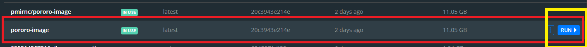
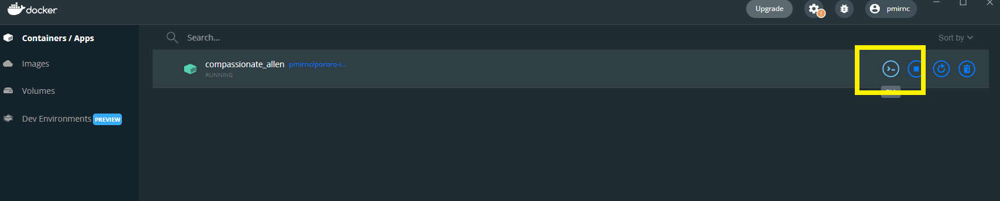
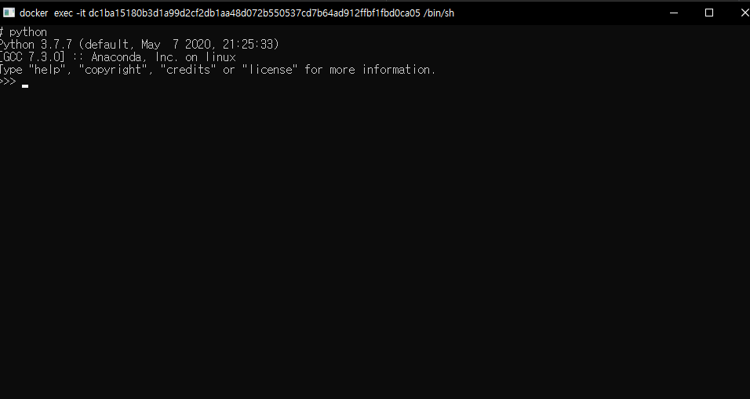

# Pororo docker container

카카오 브레인의 자연어 처리 라이브러리인 `pororo`를 docker container로 빌드해서 설치하지 않아도 
사용할 수 있도록 했습니다.

<hr/>

1. `Docker` 설치
<br/>
https://docs.docker.com/desktop/windows/install/

* docker가 cpu 점유율이 높으니 평소에는 꺼놓으시는 게 좋습니다(tray에서 종료)


3. `Docker` image pull (docker hub에 공개되어 있습니다.)
<br/>
https://hub.docker.com/r/pmirnc/pororo-image

```commandline
docker pull pmirnc/pororo-image:latest
```

3. Docker container inspect







<div style="text-align:center;">
    
</div>


4. github 문서 참조하여 실행해보시면 됩니다
<br/><br/>
깃허브
https://github.com/kakaobrain/pororo/blob/master/README.ko.md
<br/>
Documentation
https://kakaobrain.github.io/pororo
